Anypoint ServiceNow Connector Demo
==================================


## INTRODUCTION
------------


* The present demo provides an application that contains sample flows which invoke **ServiceNow CRUD** operations.


## Prerequisites
In order to build and run this project, you'll need;
* Java 8
* Anypoint Studio 7.x
* Mule Runtime 4.1.x or higher
* Anypoint ServiceNow v6.3.0
* Credentials for a ServiceNow instance


## Import the project

* Go to **File > Import**.
* Select **Anypoint Studio Project from File System** (under the parent folder "Anypoint Studio").
* Provide the root **path to the demo** project folder.
* Select **Mule Runtime (4.1.x EE)** or higher.
* Click **Finish**.
* Set credentials inside the file `src/main/resources/mule-app.properties`.

   ```
   servicenow.username=
   servicenow.password=
   servicenow.serviceEndpoint=
   ```
   
* Open the **Global Element Configuration**.
   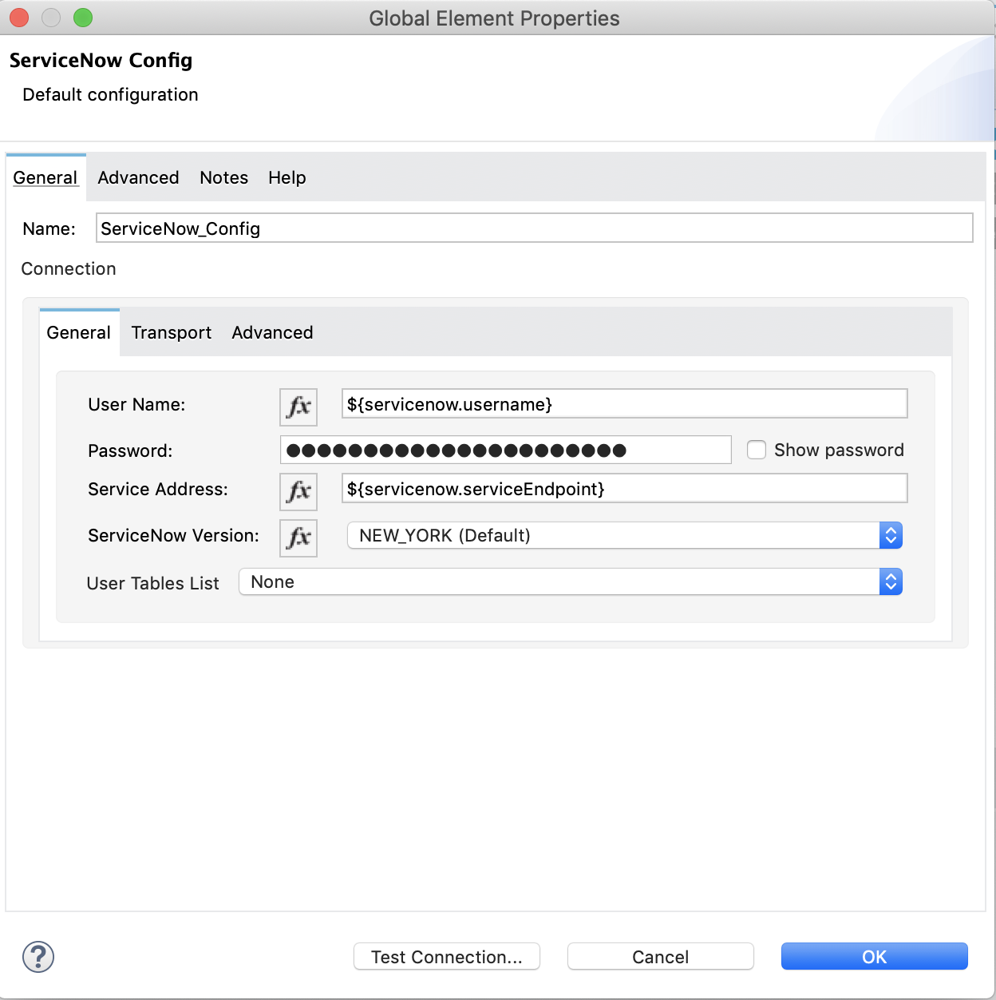
   
* Click the **Test Connection** button to ensure there is connectivity with the sandbox. A successful message should pop-up.

## Run the demo

* Go to **Run > Run As > Mule Application**. 

## example-servicenow-operations-demo-weave :

* Open a browser and access the URL **http://localhost:8081/**. You should see the **Insert form** with prepopulated category and description fields.

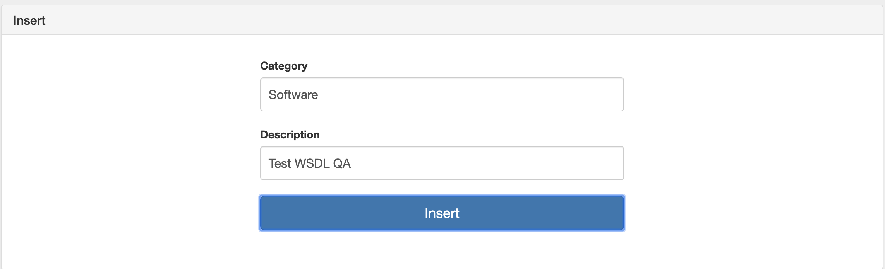

* Click on **Insert** button.
* You should see an alert showing that record was successfully created with its corressponding IDs.

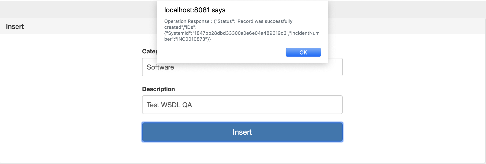

* Click on **Get Keys** form, after the form shows up, click on **Get Keys** button. 

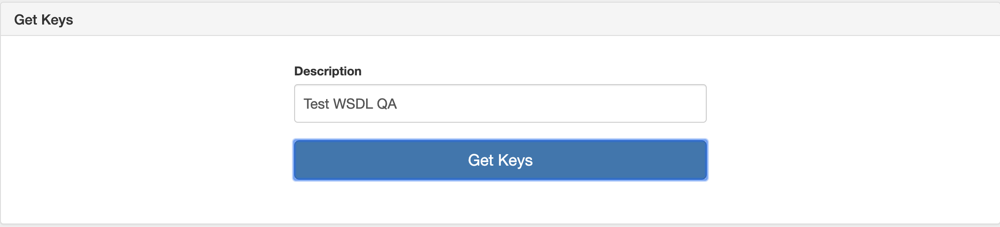

* You should see an alert showing number of keys created along with their corresponding IDs.

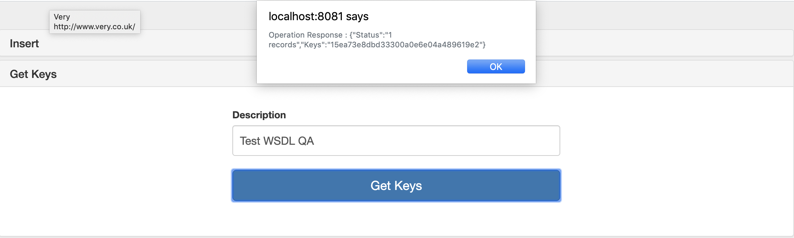

* Click on **Get Records** form, after the form shows up, click on **Get Records** button.

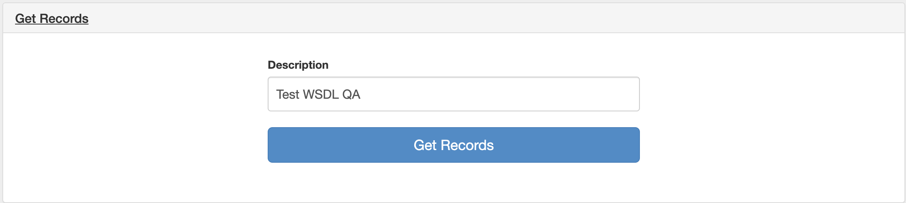

* You should see an alert showing the data of every record with given description.

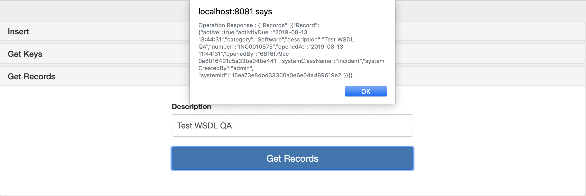

* Click on **Delete Multiple** form, after the form shows up, click on **Delete Multiple** button.

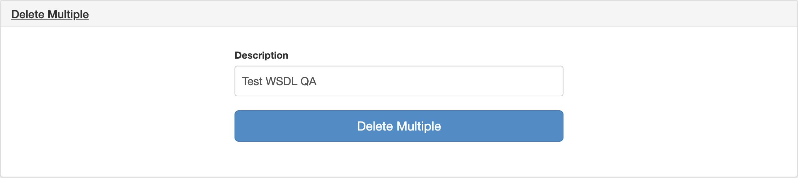

* You should see an alert showing the number of records which were successfully deleted.

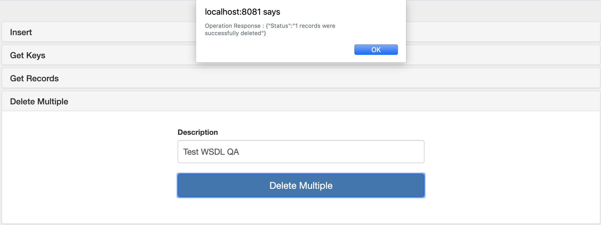

* Click on **Update** form, after the form shows up, click on **Update** button.

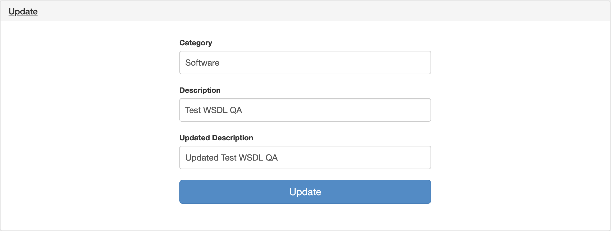

* You should see an alert showing that record was successfully updated with its corressponding ID.


**Note: Record will be created before the update**

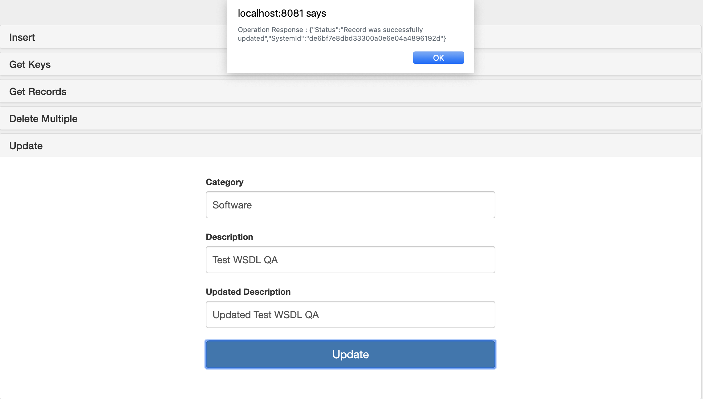
  
  

## See more
* For additional technical information on the ServiceNow Connector, visit our [technical reference documentation](https://docs.mulesoft.com/connectors/servicenow/servicenow-reference) or refer to the [ServiceNow Documentation Site](https://docs.mulesoft.com/connectors/servicenow/servicenow-connector).
* For more information on ServiceNow, go to the [ServiceNow API site](https://developer.servicenow.com/app.do#!/rest_api_doc?v=newyork&id=c_TableAPI).
